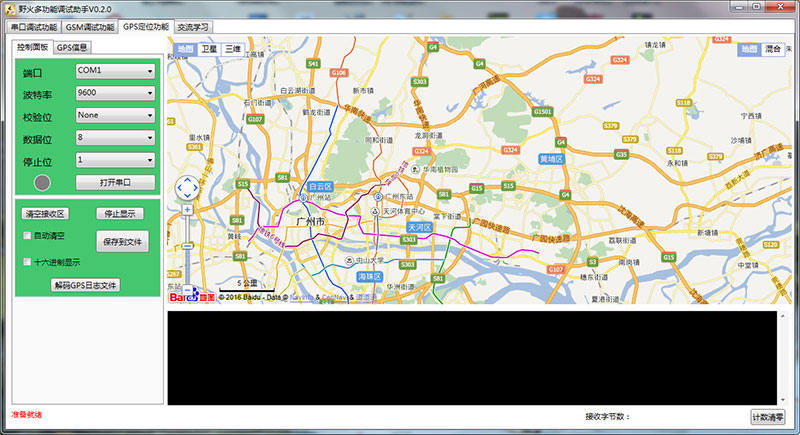

野火多功能调试助手上位机
========================

多功能调试助手FireTools【新版Qt】
------------

    下载地址1：http://t.cn/A6w7JiKs （境外，sourceforge）

    下载地址2：https://cloud.embedfire.com/software/FireClass/package/FireClass-Installer-x64-v1.0.2.4.exe

    下载地址3：https://pan.baidu.com/s/1N6ODCAO4i2x8rXXOLMJm4Q 提取码：hn4w（百度云下载）

    
    详情介绍：https://www.firebbs.cn/forum.php?mod=viewthread&tid=29790

多功能调试助手【旧版C#】
------------

旧版C#野火多功能调试助手上位机开源，请看下面介绍。
为方便大家学习如何开发嵌入式中常用的上位机软件，
我们的《串口调试助手》、《GSM调试助手》、《GPS调试助手》、《网络调试助手》、《摄像头调试助手》
现在已经开放源代码，这些上位机是使用C# (.net
WPF)编写的，使用VS2013开发环境

帖子链接：http://www.firebbs.cn/forum.php?mod=viewthread&tid=11985

产品图片
--------

