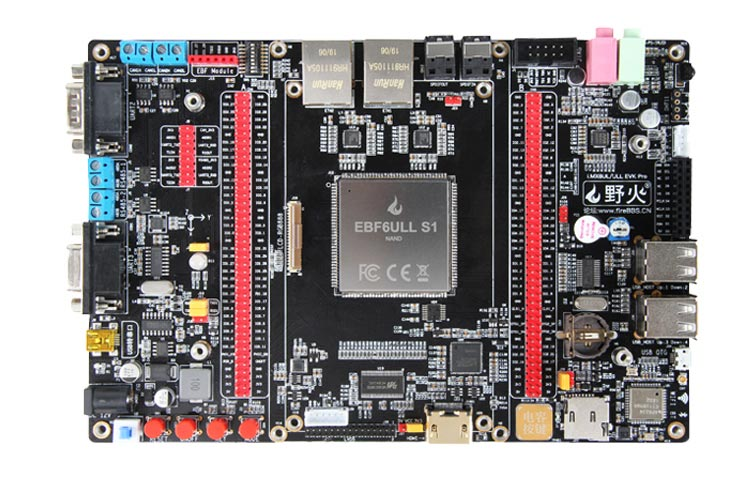
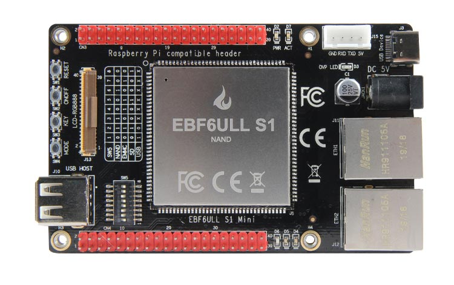
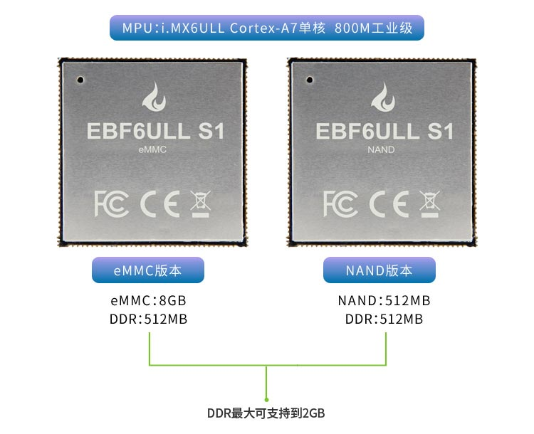
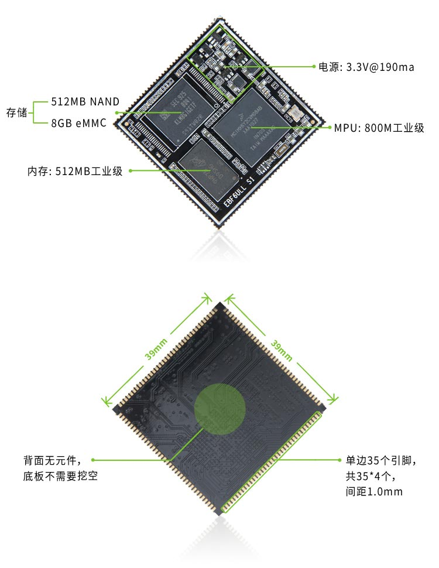

野火i.MX6ULL Linux开发板
========================

在线文档
--------

-  《[野火]i.MX Linux开发实战指南》: http://tutorial.linux.doc.embedfire.com

-  《 [野火]EBF6ULL 硬件资料 》: https://ebf-6ull-hardware.readthedocs.io

*推荐直接阅读在线文档，里面是更新中的最新状态，在页面左下角可以另存为HTML离线浏览*

配套视频 
--------

在线视频：

第一期-零基础入门篇-47集 ：https://www.bilibili.com/video/BV1JK4y1t7io

第二期-内核编程篇-20集   ：https://www.bilibili.com/video/BV1PK411T7MA

第三期-裸机开发篇-21集   ：https://www.bilibili.com/video/BV1JK4y1Y7xQ

第四期-驱动开发篇-现有82集 ：https://www.bilibili.com/video/BV1pf4y1974n

基础驱动篇暂时完结，文档整理后更新。

全部视频云盘下载：       https://pan.baidu.com/s/1jp15pPk5gCF3q2IKDF_95A  提取码：wcfa 

视频课件与笔记云盘下载:  https://pan.baidu.com/s/1NM47YIOC6JWu95uCDZ0NyA  提取码：a0h9

视频课件与笔记仓库:      https://gitee.com/Embedfire-imx6/embed_linux_tutorial_ppt

综合资料下载链接（网盘）
--------------------
资料还在持续更新中，敬请关注。

-  野火i.MX6ULL Linux开发板配套资料，包含和适用于：

1. 【i.MX 6ULL S1邮票孔 B1BTB F1金手指  核心板】
2. 【i.MX 6ULL Pro Mini  底板】

**云盘资料主要下载“0-开发板用前必读”、“1-野火开源图书合集”、“2-硬件资料”、“3-Debian镜像”、“5-NXP官方手册”、“6-开发软件”、“7-参考资料” 。**

**源码部分需要从页面下仓库地址直接git克隆获取**

- 综合资料百度云资料链接：
  https://pan.baidu.com/s/1kJdJ6xc12Yg4rPby_MatDA

  提取码：4u7d 

Debian镜像单独链接 (教程中使用系统)
-----------
此处发布的Debian镜像适用于野火imx6开发板，使用debian镜像非常方便于应用apt工具安装各种各样的软件，如gcc、python、java等环境，完全可以把它当成普通debian来使用。

百度云链接：https://pan.baidu.com/s/1pqVHVIdY97VApz-rVVa8pQ 
提取码：uge1 

sourceforge链接：
https://sourceforge.net/projects/ebf-debian-firmware/files/

Git代码仓库
----------------------
网盘的代码更新管理不方便，我们建议大家到github或国内gitee中下载源码，仓库内容同步一致，教程对应章节或者项目readme部分有相关说明：

**总仓库**

Github ：https://github.com/Embedfire  

Gitee  : https://gitee.com/Embedfire

**野火《i.MX Linux开发实战指南》章节代码**

Github ：https://github.com/Embedfire/embed_linux_tutorial 

Gitee  : https://gitee.com/Embedfire/embed_linux_tutorial

**Debian镜像**

-  Debian文件系统

Github ：https://github.com/Embedfire/ebf-image-builder

Gitee  : https://gitee.com/Embedfire/ebf-image-builder
   
-  Debian_QtApp源码 

Github ：https://github.com/Embedfire/ebf_linux_qt_demo/

Gitee  ：https://gitee.com/Embedfire/ebf_linux_qt_demo/

-  Debian_Uboot源码      

Github ：https://github.com/Embedfire/ebf-buster-uboot 

Gitee  ：https://gitee.com/Embedfire/ebf-buster-uboot

-  Debian_Linux内核源码

Github ：https://github.com/Embedfire/ebf-buster-linux  

Gitee  : https://gitee.com/Embedfire/ebf-buster-linux
   
-  Debian_设备树插件

Github ：https://github.com/Embedfire/ebf-linux-dtoverlays  

Gitee  : https://gitee.com/Embedfire/ebf-linux-dtoverlays

**Yocto(buildroot)镜像**

-  Yocto

云盘资料目录： i.MX6ULL 系列\4-Yocto(buildroot)镜像\3-构建工具

-  Buildroot

Github ：https://github.com/Embedfire/ebf_6ull_buildroot  

Gitee  :  https://gitee.com/Embedfire/ebf_6ull_buildroot

-  QtApp源码

Github ：https://github.com/Embedfire/ebf_linux_qt_demo     

Gitee  ：https://gitee.com/wildfireteam/ebf_linux_qt_demo

-  Uboot源码 

Github ：https://github.com/Embedfire/ebf_6ull_uboot        

Gitee  ：https://gitee.com/wildfireteam/ebf_6ull_uboot

-  Linux内核源码  

Github ：https://github.com/Embedfire/ebf_6ull_linux        

Gitee  : https://gitee.com/wildfireteam/ebf_6ull_linux

产品图片
--------

i.MX 6ULL S1 Pro底板
~~~~~~~~~~~~~~~~~~~~

i.MX 6ULL S1 Mini底板
~~~~~~~~~~~~~~~~~~~~~

i.MX 6ULL S1 邮票孔接口核心板
~~~~~~~~~~~~~~~~~~~~~~~~~~~~~

