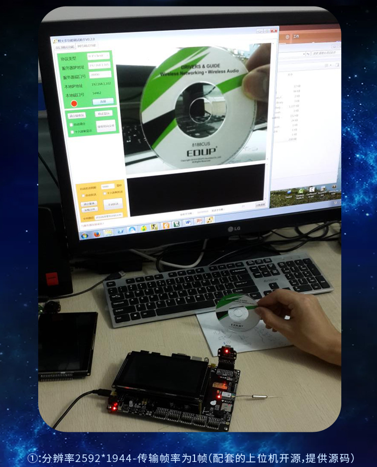
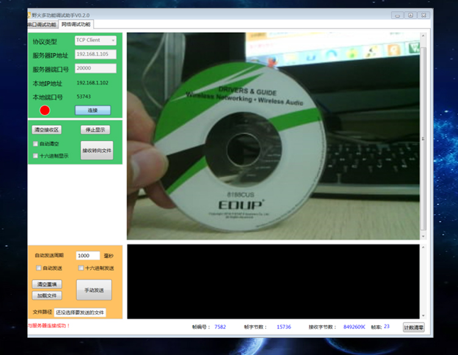

野火【WiFi_AP6181】模块
============================

野火的STM32挑战者、Pro及RT1052 Pro系列开发板都板载了AP6181 WiFi模块，
该模块使用SDIO接口进行通讯，传输速率可达2MB/s，
野火为该模块在STM32、RT1052上配套了使用Lwip进行各种联网操作的应用，
包括mqtt、服务器、客户端以及网络摄像头的应用例子。

适配的开发板
--------------------
以下是各开发板配套的模块下载地址，github仓库和gitee仓库的内容是一样的，在国内gitee下载会快一点。

.. list-table:: 适配的开发板
   :header-rows: 1
   :stub-columns: 1
   :align: center
   :widths: 20 40 40

   * - 开发板
     - github仓库
     - gitee仓库

   * - :doc:`../../stm32/ebf_stm32f429_tiaozhanzhe_v1`
     - `github-wifi-ap6181-f429-code <https://github.com/Embdefire/wifi-ap6181-f429-code>`_
     - `gitee-wifi-ap6181-f429-code <https://gitee.com/wildfireteam/wifi-ap6181-f429-code>`_

   * - :doc:`../../stm32/ebf_stm32f429_tiaozhanzhe_v2`
     - `github-wifi-ap6181-f429v2-code <https://github.com/Embdefire/wifi-ap6181-f429v2-code>`_
     - `gitee-wifi-ap6181-f429v2-code <https://gitee.com/wildfireteam/wifi-ap6181-f429v2-code>`_

   * - :doc:`野火STM32F767(V1和V2) <../../stm32/ebf_stm32f767_tiaozhanzhe_v2>`
     - `github-wifi-ap6181-f767-code <https://github.com/Embdefire/wifi-ap6181-f767-code>`_
     - `gitee-wifi-ap6181-f767-code <https://gitee.com/wildfireteam/wifi-ap6181-f767-code>`_

   * - :doc:`../../stm32/ebf_stm32h743_tiaozhanzhe_v2`
     - `github-wifi-ap6181-h743-code <https://github.com/Embdefire/wifi-ap6181-h743-code>`_
     - `gitee-wifi-ap6181-h743-code <https://gitee.com/wildfireteam/wifi-ap6181-h743-code>`_

   * - :doc:`../../stm32/ebf_stm32h743_pro`
     - `github-wifi-ap6181-h743pro-code <https://github.com/Embdefire/wifi-ap6181-h743pro-code>`_
     - `gitee-wifi-ap6181-h743pro-code <https://gitee.com/wildfireteam/wifi-ap6181-h743pro-code>`_

   * - :doc:`../../stm32/ebf_stm32h750_pro`
     - `github-wifi-ap6181-h750-code <https://github.com/Embdefire/wifi-ap6181-h750-code>`_
     - `gitee-wifi-ap6181-h750-code <https://gitee.com/wildfireteam/wifi-ap6181-h750-code>`_

   * - :doc:`../../i.mx-rt/ebf_i.mx-rt1052`
     - `github-wifi-ap6181-rt1052-code <https://github.com/Embdefire/wifi-ap6181-rt1052-code>`_
     - `gitee-wifi-ap6181-rt1052-code <https://gitee.com/wildfireteam/wifi-ap6181-rt1052-code>`_

配套模块
-------------------
AP6181支持与以下模块配合使用。

.. list-table:: 配套模块
   :header-rows: 1
   :stub-columns: 1
   :align: center
   :widths: 20 80

   * - 模块
     - 应用

   * - :doc:`../camera/ov2640`
     - 无线视频采集，代码在AP6181的仓库

   * - :doc:`../camera/ov5640`
     - 无线视频采集，代码在AP6181的仓库

产品图片
--------

.. figure:: media/ap6181/param.jpg
   :alt: param

