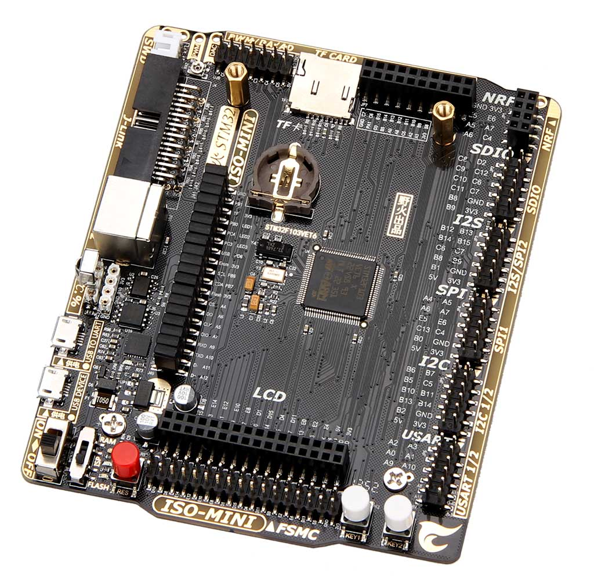

【旧】野火MINI-V1开发板资料
=============================

资料下载链接
------------

MINI-V1开发板资料为旧产品，使用本资料时请务必注意区分产品类型，

MINI-V1开发板与目前在售的开发板的外观主要区别为：

MINI-V1不含WIFI模块，目前在售的MINI开发板含WIFI模块。

MINI-V1与MINI-V2的主要区别是，MINI-V1 USB接口使用micro USB，MINI-V2
USB接口使用MINI USB（USB接口稍大）

-  百度网盘 下载链接：https://pan.baidu.com/s/1jIASryjx279WC8FNQf9T1w 提取码：ozsh

产品图片
--------

