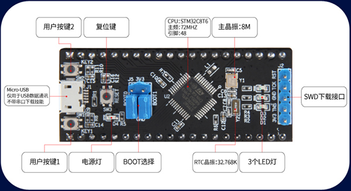

野火STM32F103C8T6核心板
=======================

资料下载链接
------------

野火STM32F103C8T6核心板资料链接：

-  链接：https://pan.baidu.com/s/1Elgc4nvxXjiHLSZ2nXnSCQ
-  提取码：bmba

重要说明
--------

* 野火STM32F103C8T6核心板 **教程** 可以参考 :doc:`ebf_stm32f103_mini`

* 但 **代码不能** 直接使用野火STM32F103_MINI开发板的，因为其STM32主控芯片不同，且没有SPI FLASH，EEPROM等。*

--------------

使用开发板时请使用本资料配套的代码工程。

与MINI开发板配套的工程主要差别在于：

1. “Options for target > devices”选项下需要选择芯片型号为“STM32F103C8”
#. “Options for target >
   C/C++”选项下的STM32宏需要使用“STM32F10X_MD”（不含引号）
#. 工程的启动文件组 “STARTUP”下需要使用文件“startup_stm32f10x_md.s”

具体请对照本资料提供的范例工程。

产品图片
--------

STM32F103C8T6核心板
~~~~~~~~~~~~~~~~~~~

