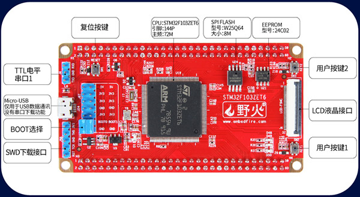

野火STM32F103ZET6核心板
=======================

资料下载链接
------------

野火STM32F103ZET6核心板资料链接：

-  资料盘 链接： https://pan.baidu.com/s/15QPKjiUviFQlsP5vMVMntw
-  提取码：uoi6

重要说明
--------

**本核心板硬件裁剪自** :doc:`ebf_stm32f103_badao_v2` **,教程和程序均可直接参考该开发板的资源。**

兼容资料下载链接：:doc:`ebf_stm32f103_badao_v2`

1. 核心板使用的STM32主控型号与 霸道_V2开发板完全一样，为STM32F103ZET6
#. 核心板包含有按键，流水灯，EEPROM，FLASH，USB，串口，SD卡槽，液晶接口及引出所有IO
#. 核心板所具有的硬件资源与STM32主控连接方式跟 霸道_V2开发板
   完全一样，（即用外接的信号原理图一样）
#. 只要相关程序依赖的硬件在本核心板都有的话，配套在 霸道_V2开发板
   上的程序均能直接使用

产品图片
--------

STM32F103ZET6核心板
~~~~~~~~~~~~~~~~~~~

