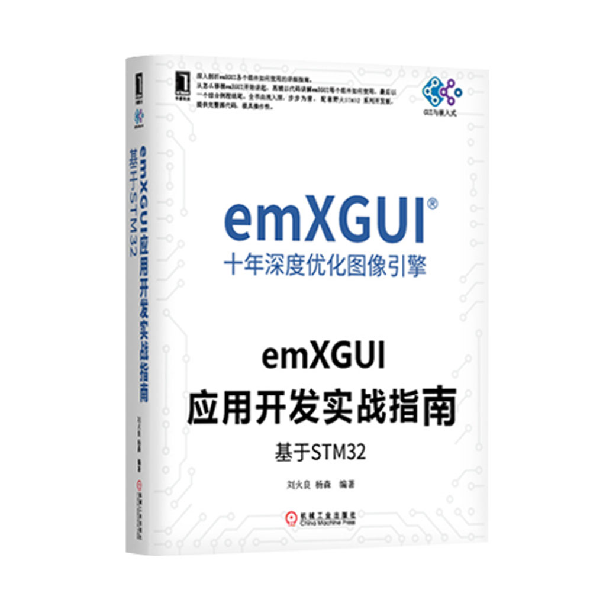

[野火]《emXGUI实战指南》系列
============================

在线文档
^^^^^^^^^^^^

`《emXGUI应用开发实战指南》 <https://emxgui-tutorial-doc.readthedocs.io>`_

配套示例代码
^^^^^^^^^^^^^

emXGUI基础入门示例包含适配到STM32和i.MX RT1052的各种控件使用示例。

示例代码Git仓库地址：

- `github-emXGUI_tutorial_code <https://github.com/Embedfire-emxgui>`_
- `gitee-emXGUI_tutorial_code <https://gitee.com/organizations/Embedfire-emxgui>`_

百度云下载链接
^^^^^^^^^^^^^^^^^^^
百度云下载链接会不定期更新，请尽量在git仓库下载使用。

[野火]《emXGUI实战指南》系列丛书：

- 链接：https://pan.baidu.com/s/1YeBNP_x5WCPmOwDjUGH_pg
- 提取码：u1k9 

emXGUI综合程序简介：http://t.cn/EKOyNBa

产品图片
--------

emXGUI实战指南
~~~~~~~~~~~~~~

