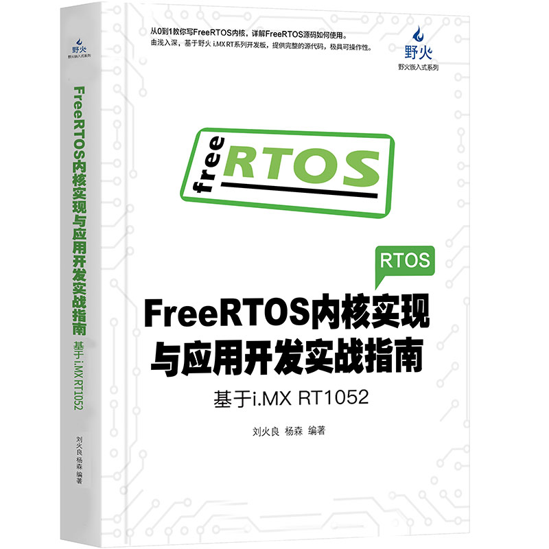
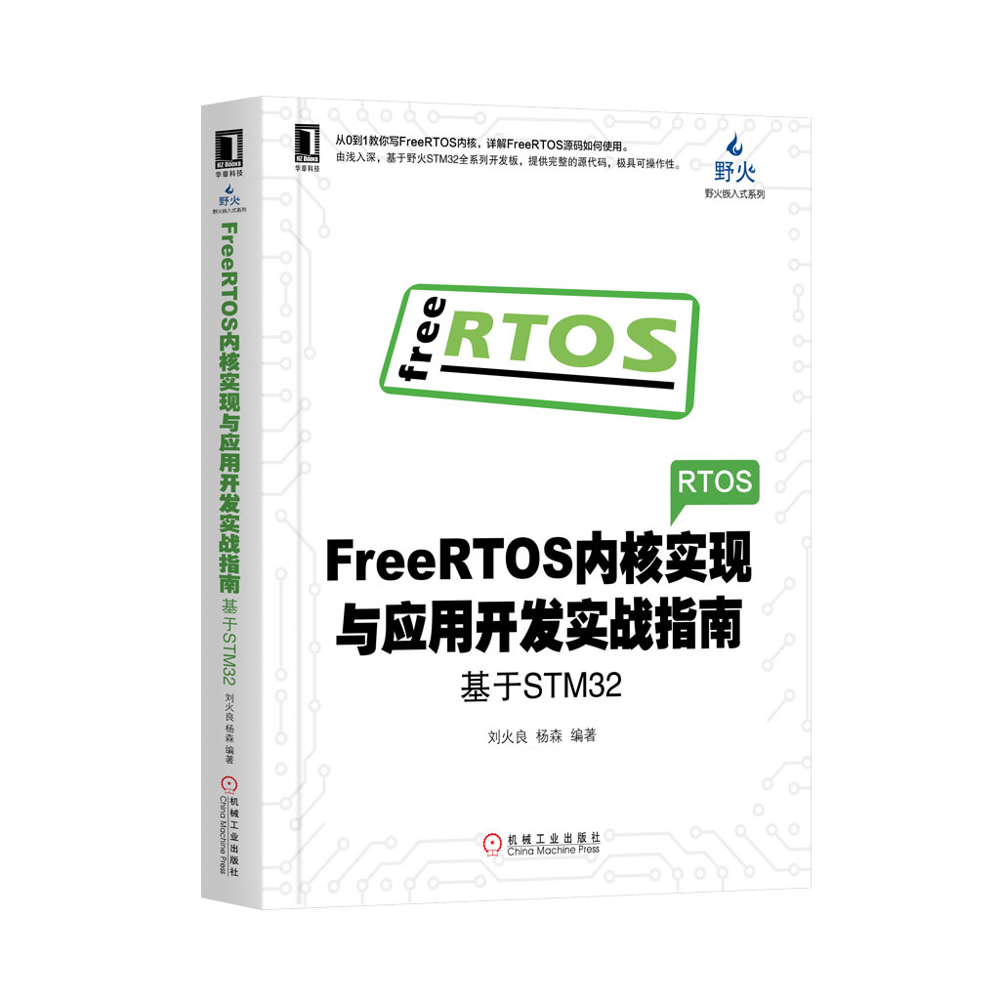

[野火]《FreeRTOS内核实现与应用开发实战指南》系列
================================================

资料下载链接
------------

本资料包含野火各开发板配套的程序，可根据需要选择下载。

教程及代码适配 ``STM32`` 及 ``RT1052`` 开发板

[野火]《FreeRTOS内核实现与应用开发实战指南》系列：

- 链接：https://pan.baidu.com/s/1C7py3OTJV-Bx3Hlv2m4nUA
- 提取码：jz6h

配套视频
---------------------

[野火] 【视频】《FreeRTOS内核实现与应用开发实战指南》系列视频教程，
本视频教程适配野火所有开发板：

- 哔哩哔哩在线观看：https://www.bilibili.com/video/av57449565

- 百度云链接：

    - 链接：https://pan.baidu.com/s/1ABhcbSxQm74-JQ-2e9HEGw
    - 提取码：emqh

产品图片
--------

(含STM32及RT1052版本)FreeRTOS内核实现与应用开发实战指南
~~~~~~~~~~~~~~~~~~~~~~~~~~~~~~~~~~~~~~~~~~~~~~~~~~~~~~~

