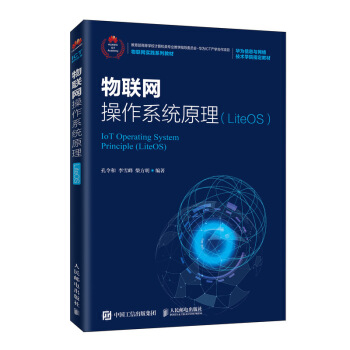

[野火]《物联网操作系统 LiteOS开发实战指南》系列
===============================================

资料下载链接
------------

本资料目前包含野火所有STM32开发板的系统内核应用例程。

[野火]《物联网操作系统 LiteOS开发实战指南》系列：

- 链接：https://pan.baidu.com/s/1syhnalGZ4iQzmTUIpEVK_g
- 提取码：4jf3

产品图片
--------

物联网操作系统 LiteOS开发实战指南
~~~~~~~~~~~~~~~~~~~~~~~~~~~~~~~~~

