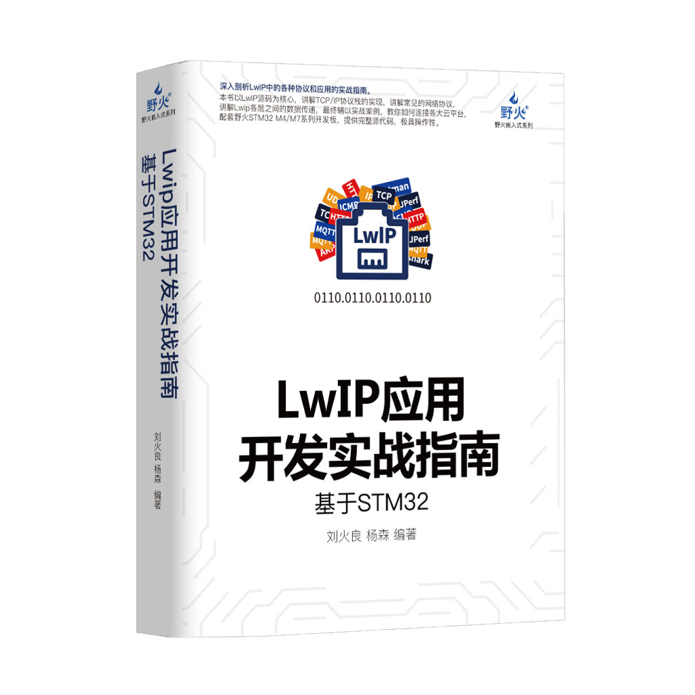

[野火]《LwIP应用开发实战指南》系列
==================================

资料下载链接
------------

本资料包含野火各开发板配套的程序，可根据需要选择下载。

教程及代码适配\ ``STM32``\ 及\ ``RT1052``\ 开发板

[野火]《LwIP应用开发实战指南》系列：

- 链接：https://pan.baidu.com/s/1O3EKcZ5JFGKYdFGMOpJGNQ
- 提取码：b92p

配套视频
------------------

[野火] 【视频】《LwIP应用开发实战指南》系列视频教程，
本视频教程适配野火所有M4/M7开发板：

- 哔哩哔哩在线播放链接：https://www.bilibili.com/video/av59550450/

- 百度云链接：

    - 链接：https://pan.baidu.com/s/1i5vDVdzBgk6tLcDExWrHWQ
    - 提取码：s95p

产品图片
--------

(含STM32及RT1052版本)LwIP应用开发实战指南
~~~~~~~~~~~~~~~~~~~~~~~~~~~~~~~~~~~~~~~~~

