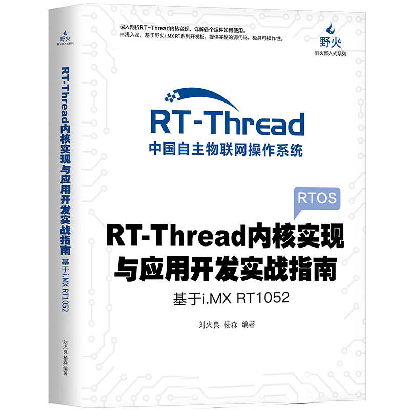
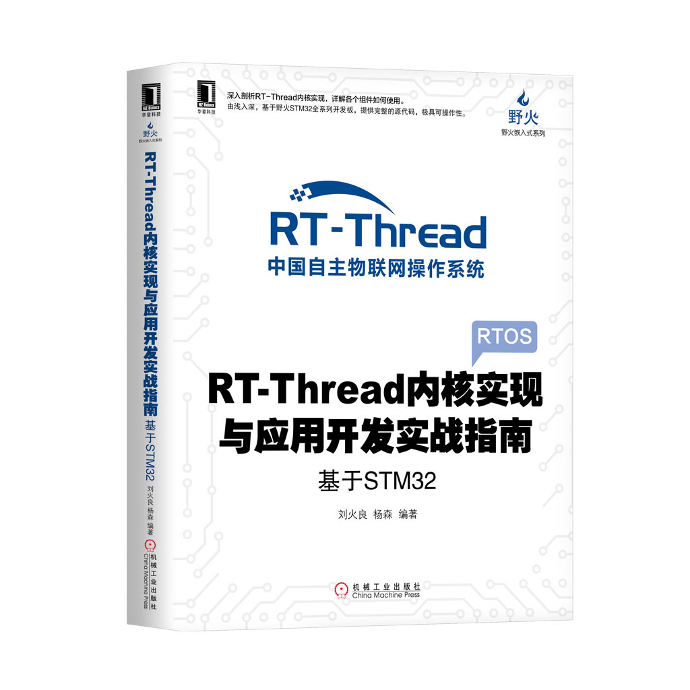

[野火]《RT-Thread内核实现与应用开发实战指南》系列
=================================================

资料下载链接
------------

本资料包含野火各开发板配套的程序，可根据需要选择下载。

教程及代码适配\ ``STM32``\ 及\ ``RT1052``\ 开发板

[野火]《RT-Thread内核实现与应用开发实战指南》系列：

- 链接：https://pan.baidu.com/s/1sgoeeDnlWh2tYde8EVhHPw
- 提取码：6c8p

产品图片
--------

(含STM32及RT1052版本)RT-Thread内核实现与应用开发实战指南
~~~~~~~~~~~~~~~~~~~~~~~~~~~~~~~~~~~~~~~~~~~~~~~~~~~~~~~~

