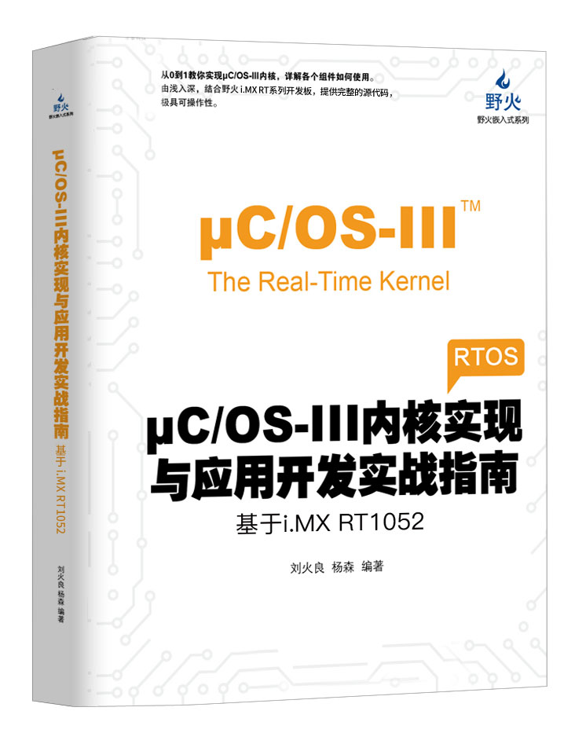
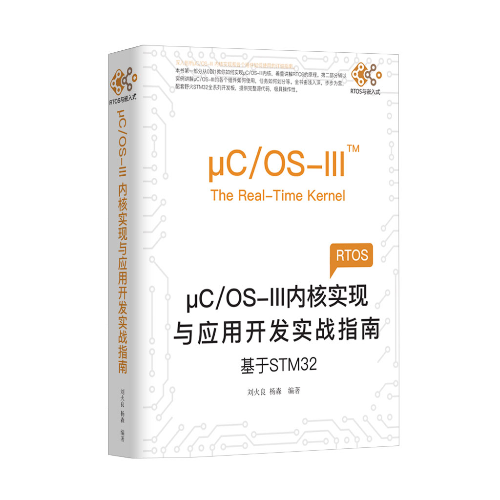

[野火]《uCOS-III内核实现与应用开发实战指南》系列
================================================

资料下载链接
------------

本资料包含野火各开发板配套的程序，可根据需要选择下载。

教程及代码适配\ ``STM32``\ 及\ ``RT1052``\ 开发板

[野火]《uCOS-III内核实现与应用开发实战指南》系列：

- 链接：https://pan.baidu.com/s/1T7TRRLvEYZH2-V3ef-UVDg
- 提取码：bbty

配套视频
-------------

[野火] 【视频】《uCOS-III内核实现与应用开发实战指南》系列视频教程，
本视频教程适配野火所有开发板：

- 哔哩哔哩在线观看 ：https://www.bilibili.com/video/av62027241/

- 百度云链接：

    * 链接：https://pan.baidu.com/s/1M1tHeFCNNPqMUlK6uW8liA
    * 提取码：f607

产品图片
--------

(含STM32及RT1052版本)uCOS-III内核实现与应用开发实战指南
~~~~~~~~~~~~~~~~~~~~~~~~~~~~~~~~~~~~~~~~~~~~~~~~~~~~~~~

